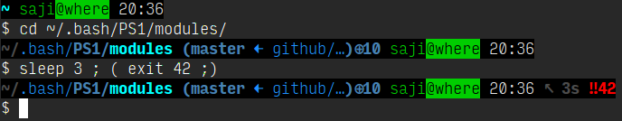

Modular bash prompt
===================

Usage
-----
Checkout wherever (`~/.bash/PS1/` is a good choice) and add this
to your `~/.bashrc`:

    . WHEREVER/presets/saji
    
Your new terminals should look like this:

Modules and presets
-------------------
See `presets/saji` for an example on how presets can be made.

Modules should export variable or function with called
`PS1_${MODULE_NAME}` and additionally can export more things called
`PS1_${MODULE_NAME}__${SUBNAME}`. Common example is a function
`PS1_${MODULE_NAME}__get`, which is useful for using in other modules.
Most main modules' function take one parameter: string that is
attached before a value, if any is printed -- it's useful for
adding leading space and colour escape sequence.

See module files for more information on how to use them.

Contributing
------------
Feel free to for and add new modules and/or presets.

License
-------
Licensed under MIT. See LICENSE file.
